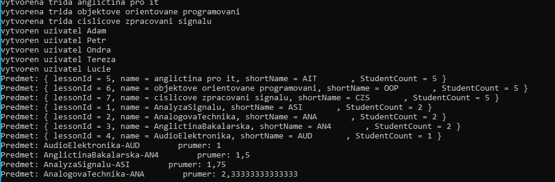
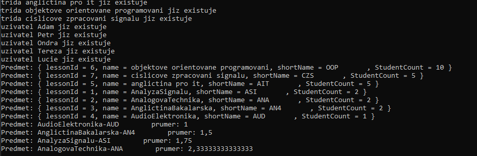
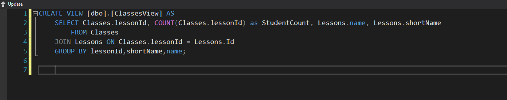
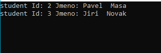
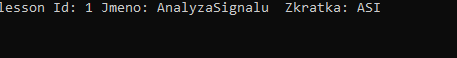
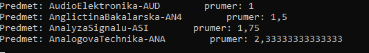

#Program s komentari se provede takto:
## Pokus 1

## Pokus 2 - uzivatele jiz existuji

### ukol 5 - create view query

### ukol 6 -vypis testu query studentu a trid

### ukol 8 -zde je podobny vypis jako pri plnem provedeni aplikace,ale bez vlozenych hodnot
